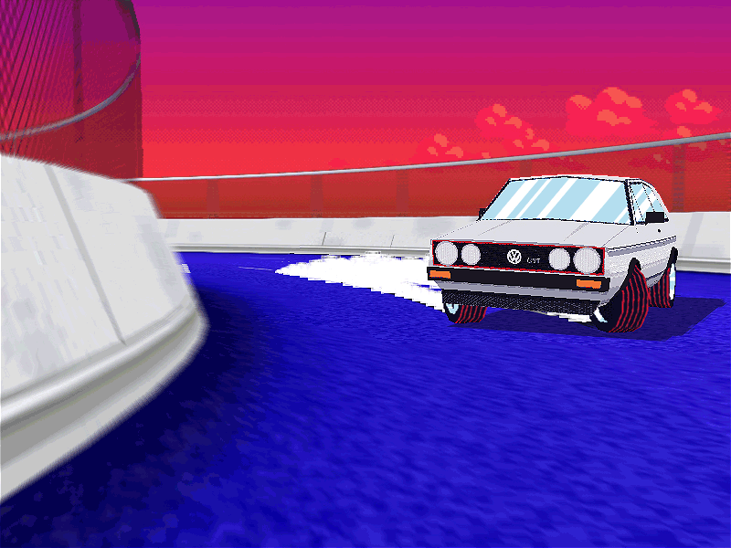
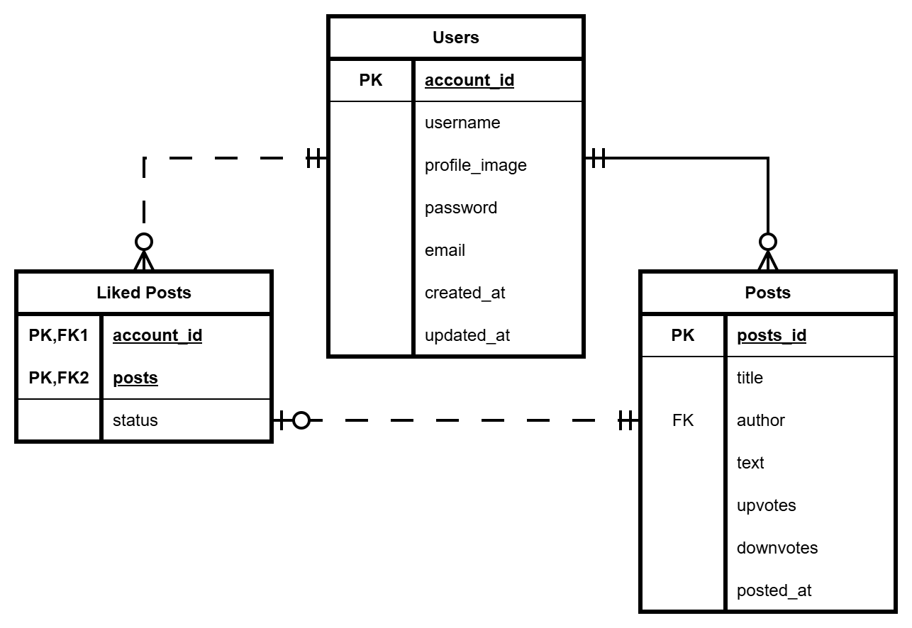

<h1 align="center">
 🌈✨🚗Locomo.to (Chillproject)✨🌈
</h1>

A simple webpage about cars and automotives. 

 

## Implementation 👷
We utilized MVC, OOP and other related Design Patterns for a clean and concise code.🀄

## How to use it? ⚓
**Step 1.** Use `cd ./public` to go to /public folder.  
**Step 2.** Use `php -S localhost:8080` to run php along with `index.php`.  
**Step 3.** Check the local webpage using your browser. 

## Requirements 🛍️
- A working PHP version 8 and above 🎱
- A working SQLite3 that works with PHP. *(Implementation of other database needed.)* 🎼

## Entity Relationship Diagram 📊

## 🎗️ REMINDERS!!! 🎗️
### 🎒 Backend 🎒
- [x] Model
- [x] View
- [x] Controller
- [ ] 'Post' and Liked 'Liked Post' model and database implementation.
- [ ] MySQL database implementation.
- [ ] A logout function.
- [ ] Search Query using 'LIKE' for a flexibility.
- [ ] Improve parameter checking and model validation.

### 🐥 Frontend 🐥
- use sass 
- [ ] Contact Us - Create page
- [ ] Home - Landing page
- [ ] Layout
- [ ] Login - Add styles, Validation
- [ ] Not Found - Add Styles
- [ ] Register - Add Styles, Validation
